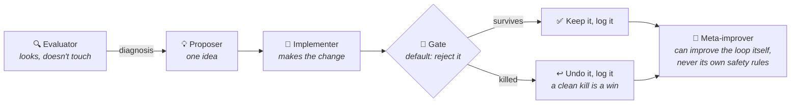

<div align="center">

```
███████╗ ███████╗ ██╗      ███████╗ ███████╗ ███╗   ███╗ ██╗ ████████╗ ██╗  ██╗
██╔════╝ ██╔════╝ ██║      ██╔════╝ ██╔════╝ ████╗ ████║ ██║ ╚══██╔══╝ ██║  ██║
███████╗ █████╗   ██║      █████╗   ███████╗ ██╔████╔██║ ██║    ██║    ███████║
╚════██║ ██╔══╝   ██║      ██╔══╝   ╚════██║ ██║╚██╔╝██║ ██║    ██║    ██╔══██║
███████║ ███████╗ ███████╗ ██║      ███████║ ██║ ╚═╝ ██║ ██║    ██║    ██║  ██║
╚══════╝ ╚══════╝ ╚══════╝ ╚═╝      ╚══════╝ ╚═╝     ╚═╝ ╚═╝    ╚═╝    ╚═╝  ╚═╝

                     evaluate → change → gate → repeat
```

**A template for Claude Code loops that improve something on their own, in small steps, without lying to you about it.**


[](LICENSE)

</div>

## In plain terms

You give this loop something you can measure: a test pass rate, a latency number, an accuracy score, anything a command can print as a number. Each time it runs, it does four things:

1. Looks at how things are doing right now.
2. Makes exactly one small, reversible change that it thinks will help.
3. Has a second, skeptical AI try to prove the change is fake, unsafe, or a fluke, using an actual statistics check, not a vibe check.
4. Keeps the change only if it survives that check, and writes down what happened either way, including the times it failed.

Then it does that again next time you run it. Nothing gets promoted unless a skeptic tried to kill it and couldn't.

```bash
git clone https://github.com/mboss37/selfsmith && cd selfsmith/examples/latency-tuner
pip install -r requirements.txt && python -m pytest sim/ -q   # watch the whole thing prove itself
claude                                                        # then type: /iterate
```

No API key needed for the examples. They run offline with fake but realistic data.

---

## Table of contents

- [Why this exists](#why-this-exists)
- [How it works](#how-it-works)
- [The examples](#the-examples)
- [Build your own loop](#build-your-own-loop)
- [How one run works, step by step](#how-one-run-works-step-by-step)
- [Ways to run it](#ways-to-run-it)
- [How safe is "unattended"?](#how-safe-is-unattended)
- [The 10 rules](#the-10-rules)
- [Repo layout](#repo-layout)
- [Glossary](#glossary)
- [FAQ](#faq)
- [Contributing](#contributing)

---

## Why this exists

If you just tell an AI "keep improving this in a loop", a few things go wrong in practice, and they go wrong quietly:

- It starts optimizing for the number instead of the thing the number was supposed to measure. A support-triage bot can "improve" by learning a shortcut that works on your test cases and nowhere else. A latency tuner can "improve" by failing fast instead of actually being faster.
- The AI reviewing its own change is the same AI (or the same kind of reasoning) that made the change, so a plausible-sounding but wrong result talks its way through.
- It edits its own safety rules when they get in the way of hitting the number.
- Once there's nothing real left to improve, it manufactures busywork so it looks productive.
- An unattended run gets stuck, runs forever, or does something destructive, and nobody notices until later.

Selfsmith is a template that builds a structural answer to each of those, not just a polite instruction asking the AI to please not do that. Here's what backs each one, specifically:

| What goes wrong | What stops it here |
|---|---|
| The loop games its own scorecard instead of actually improving | Test data is split so some of it is never used to tune against; hard limits are checked separately from the headline number; metrics are designed so cheating shows up as a worse score, not a better one |
| A result that sounds convincing but isn't real gets approved anyway | `tools/verdict.py` runs an actual statistical significance test. If you don't first say how many things you're going to try, it refuses to run at all, because the more things you try, the more likely one looks good by luck alone |
| The loop edits its own safety rules to hit the number | A gatekeeper script blocks edits to its own configuration and a list of protected files, no matter which tool the loop tries to use |
| The metric itself is broken or noisy, so every check is a coin flip | Before the loop is even allowed to start, a setup check confirms the metric gives a consistent number and can tell a known-good result from a known-bad one |
| The loop runs out of real work and starts busywork to look active | A clean "nothing worked, here's why" counts as a successful run and gets logged as one, not papered over |
| An unattended run gets stuck or runs away with cost | Each run has a time limit and a hard cap on how many steps it can take, so a stuck run gets killed instead of spinning forever |
| The gate itself quietly stops working over time | The gate runs a self-check every time: feed it something meaningless and confirm it still says no |

Every one of these has a test proving it actually works (219 tests across the two examples), and the automated checks compare the copies in each example against the template so they can't quietly drift apart.

Copy `template/`, fill in a handful of blanks, and you have a working loop for your own project. Two complete, working examples ship in the repo so you can see the whole thing running before you build your own.

---

## How it works

One AI role checks the current state and writes a diagnosis. Another proposes and makes exactly one change. A third role, the **gate**, tries to prove that change is wrong, unsafe, or too good to be true. The change only survives if the gate cannot kill it. This is Anthropic's evaluator-optimizer pattern: one side proposes, the other side is paid to disagree.



Two things make this safe to leave running unattended:

1. **A safety rule the loop physically cannot get around.** Every command and file edit passes through a small script (not a suggestion, an actual gatekeeper) before it runs. That script refuses to let the loop touch its own safety rules or a small list of protected files, and if it can't understand what's being asked, it blocks it rather than guessing. For real unattended use, pair this with an operating-system sandbox; ready-made setups ship in [`template/sandbox/`](template/sandbox/).
2. **The gate's math is code, not opinion.** A change only counts as "proven" if it passes an actual statistical test in [`tools/verdict.py`](template/tools/verdict.py), the same kind of test a scientist would use to check a result wasn't just luck. An AI reviewer can be talked into believing a good story. A statistics script cannot.

There are two shapes this loop commonly takes, and both ship as complete, working examples:

| Shape | What you're doing | Example |
|---|---|---|
| **Tune something already running** | Nudge live settings (timeouts, thresholds, config values) and check the change still holds up on newer data. | [`examples/latency-tuner/`](examples/latency-tuner/) |
| **Search for the best option** | Try a catalog of candidates and find the one that actually generalizes, not just the one that scored highest on the data you tuned against. | [`examples/prompt-technique-tournament/`](examples/prompt-technique-tournament/) |

---

## The examples

Both examples run offline with realistic, deterministic fake data (no API key, no network calls), and both are the template fully filled in, so you can read them as a reference. Each one also includes a deliberately planted bad result that looks great on the data you'd normally check and fails on the data you're not supposed to peek at. Proving the gate catches it is part of the test suite, not just a claim in this document.

### 🏆 `prompt-technique-tournament/`: search for the best option

The loop runs a tournament between different prompting techniques (few-shot examples, chain-of-thought, breaking the task into steps, and so on) for a support-message triage task, looking for whichever one actually works on messages it hasn't seen.

```bash
cd examples/prompt-technique-tournament
python eval/run_eval.py --technique few_shot --split dev --model mock   # score any technique
python -m pytest eval/ -q                                               # 129 tests, all green
claude   # then: /iterate
```

- **The planted trap:** one technique scores +2 cases better on the tuning data and +0 on the held-back data. The gate catches and rejects it automatically.
- **The winner:** a combination of three techniques takes the pass rate from 35% up to 90%, and that result holds up under a strict statistical check against the full set of candidates that were allowed to compete.
- **Worth knowing:** the data is split three ways (build from one part, tune against a second, check the winner once against a third that's never touched otherwise), and there's an optional switch to run it against a real Claude model instead of the offline fake one. Full details in [its README](examples/prompt-technique-tournament/README.md).

### ⚡ `latency-tuner/`: tune something already running

The loop tunes a service's retry settings (how long to wait, how many times to retry, how long to back off) against realistic replayed traffic. It has to fix a real problem first (the starting config causes way too many errors), then reduce latency, and every change has to keep working on more recent, worse traffic before it's kept.

```bash
cd examples/latency-tuner
python sim/run_eval.py --config config.json --window train              # score the current setting
python -m pytest sim/ -q                                                # 90 tests, all green
claude   # then: /iterate
```

- **The planted trap:** a very short timeout with lots of retries looks like the best setting on the older traffic, and causes four times too many errors on the newer, worse traffic. The gate catches and rejects it.
- **The lesson built into the metric:** if you just measure "how fast were the successful requests," failing fast looks like an improvement, because failed requests stop counting. So the real score costs every failure heavily, and a separate hard limit on the error rate is checked no matter what the speed number says.
- **Worth knowing:** the "don't peek at future data" rule here uses time (tune on last week, check against this week) instead of a fixed held-out slice, which is the more common shape for tuning something live. Full details in [its README](examples/latency-tuner/README.md).

**Which one should I read first?** If your problem is "tune the thing that's already running," read the latency-tuner. If it's "find the best option out of several," read the tournament. If you're just getting a feel for Selfsmith, either one works; they're both short.

---

## Build your own loop

### 1. Copy the template

```bash
cp -r template/ my-loop/ && cd my-loop
```

### 2. Prove your metric works first (don't skip this)

The loop is only as good as the number it's optimizing. Before you fill in anything else, open `metric-contract.env` and give it two commands: one that prints the metric for something you know is good, one for something you know is bad. Then run:

```bash
bash tools/metric-contract.sh   # must print PASS
```

This checks three things: the metric prints a plain number, it prints the same number twice in a row (so it's not too noisy to trust), and the "good" case actually scores better than the "bad" case. If you can't come up with a bad case your metric correctly scores worse, you don't actually have a working metric yet, and no amount of gate logic downstream can fix that.

### 3. Fill in the blanks

Follow [`INSTANTIATE.md`](template/INSTANTIATE.md), a step-by-step checklist with a glossary of every placeholder. The ones that matter most:

| Placeholder | What goes there |
|---|---|
| `{{PROVE_COMMAND}}` | The command that prints your metric. This is the whole point of the loop. |
| `{{VERIFY_COMMAND}}` | Your normal test or lint command. Must pass before any change is kept. |
| `{{DOMAIN_SAFETY_FLOOR}}` | The one thing that must never be traded away for a better metric. |
| `{{DOMAIN_FORBIDDEN_PATTERN}}` / `{{PROTECTED_PATHS}}` | Commands and files the safety script should block outright. |

While you're in `GOAL.md`, decide and write down how many different options this campaign is allowed to try. The statistics check refuses to certify a result without that number, on purpose; see the glossary entry on this below.

### 4. Prove the safety script actually blocks things

Checking that the script has valid syntax (`bash -n .claude/hooks/guardrail.sh`) only proves it doesn't crash. Both examples ship a test file that feeds the script real commands and checks it actually blocks the bad ones and allows the normal ones. Copy that pattern for your own forbidden-command rules.

### 5. Run it

See [Ways to run it](#ways-to-run-it) below. Start by running it manually, and only move to a schedule once you trust what's in the log.

### What a finished loop looks like

| Part | What it does |
|---|---|
| `.claude/commands/iterate.md` | The orchestrator: routes one run through the steps below, doesn't make changes itself |
| `.claude/agents/*.md` | The five roles: evaluator, proposer, implementer, gate, meta-improver |
| `.claude/hooks/guardrail.sh` + `settings.json` | The safety script the loop cannot edit or route around |
| `GOAL.md` | What the loop is trying to do, in what priority order, and how many options it's allowed to try |
| `PERSONA.md` | A short description of who the loop is "acting as" and how it should reason |
| `METHODOLOGY.md` | The rulebook for what counts as real evidence versus a fluke |
| `LOG.md` | An honest, append-only diary, one entry per run, including the failures |
| `tools/verdict.py` + `tools/metric-contract.sh` | The statistics check and the "does my metric even work" check |
| `sandbox/` | Ready-made setups (container, systemd, macOS) to actually lock the loop down at the operating-system level |
| `run-iteration.sh` + `drive-to-goal.sh` | The scripts that actually run the loop safely on a schedule or back to back |

### The five roles

Simple loops can skip the proposer and go straight from evaluator to implementer.

| Role | Can it write files? | Job |
|---|---|---|
| **Evaluator** | No | Reads the current state, writes a diagnosis and a recommendation |
| **Proposer** | No | Suggests exactly one change with a stated reason it should help |
| **Implementer** | Yes | Makes that one change, writes a test for it, measures the result |
| **Gate** | No, but has veto power | Tries to disprove the change; rejects by default when unsure |
| **Meta-improver** | Yes | Improves the loop's own prompts and process, but can never loosen a safety rule |

The gate matters most. It runs independently, the implementer can't override it, and nothing gets kept until it says so.

---

## How one run works, step by step

Each `/iterate` walks through this in order. Anywhere a command can decide the answer instead of an opinion, it does.

1. **Evaluate.** Check the current numbers and data health. A broken measurement always outranks any performance question; if in doubt, the metric check from step 2 above runs again here.
2. **Decide on one change.** Based on the diagnosis and the priorities in `GOAL.md`. Never more than one change at a time.
3. **Propose, then implement.** State a reason the change should help, then make the smallest version of it and measure the result.
4. **Gate it.** Run the self-check, then the matching statistics test, then the human-judgment checks (is this safe, is this a regression, is this redundant). A rejection here is final; the change gets undone.
5. **Verify.** The normal test suite has to pass. A change that breaks tests is never kept, no matter how good the metric looks.
6. **Prove it.** The metric actually has to move the way it was predicted to.
7. **Commit,** only after all three checks above pass.
8. **Log** exactly what happened, wins and honest failures both.
9. **Suggest improvements to the loop itself,** if any came up, routed to the meta-improver (never applied directly by the orchestrator).
10. **Notify** a human that the run finished and what happened. Never wait on a human mid-run; always leave a way to reach one.

---

## Ways to run it

| Mode | Command | Best for |
|---|---|---|
| **Manual** | `claude` then `/iterate` | Your first few runs, while you're building trust in the log |
| **Session loop** | `/loop 1h /iterate` | Supervised, continuous runs at a fixed interval (or no interval, and the model paces itself) |
| **Scheduled** (cron, launchd, systemd) | `0 * * * * cd /path/to/my-loop && ./run-iteration.sh` | Ongoing tuning, where you want gaps so new data can accumulate |
| **Run until done** | `./drive-to-goal.sh` | A campaign with a finish line: runs back to back until it converges, stalls, or hits a cap |
| **Sandboxed** | `./sandbox/run-sandboxed.sh` | Any unattended run, with an actual operating-system boundary underneath it |

For anything scheduled, always go through `run-iteration.sh`, never call `claude` directly:

- **Every run starts fresh.** No conversation memory carries over; everything the loop needs to know lives on disk (`LOG.md`, git history, the current settings), so it's always working from ground truth, not a stale mental model.
- **Only one run at a time.** If a run is already in progress, a new scheduled tick skips cleanly instead of overlapping it.
- **Each run has a time limit.** `ITER_TIMEOUT` (default 50 minutes) kills a run that's stuck instead of letting it spin forever.
- **Each run has a step limit.** `ITER_MAX_TURNS` (default 50) caps how much work, and cost, a single run can spend. Raise it on purpose if you need to; don't remove it.

---

## How safe is "unattended"?

Two separate layers, and it matters which one you're actually relying on:

**Layer 1: the gatekeeper script.** Every command and file edit is checked against a list of rules before it runs, and if the check can't make sense of what's being asked, it blocks by default rather than guessing. This catches honest mistakes reliably. What it is not: a real security boundary against a determined attempt to get around it. Clever quoting or encoding can slip past any list of text patterns.

**Layer 2: an actual operating-system sandbox.** This is the real boundary, where the operating system itself refuses to allow certain actions no matter what the loop tries. Three ready-made setups ship in [`template/sandbox/`](template/sandbox/):

| Option | How strong | What's there |
|---|---|---|
| Container | Strongest, works anywhere | A read-only filesystem, no elevated permissions, memory/CPU caps, and the safety files locked read-only even inside the one folder the loop can write to |
| systemd (Linux) | Strong, no container needed | A hardened service definition with the same restrictions built into the operating system directly |
| macOS Seatbelt | Good, built into macOS | Blocks all writes except the loop's own folder, and blocks the safety files even there |

The gatekeeper script (layer 1) and the sandbox (layer 2) are hard technical limits. The gate's veto and the loop's own good judgment are not; they're the AI reasoning well, which is valuable but not a guarantee. Before trusting a sandbox, test it: from inside, try to edit the safety files and try to write outside the loop's own folder. Both should fail with a permission error. If you haven't seen it refuse, you don't actually know it works yet.

---

## The 10 rules

The short version of everything above, useful as a checklist once you understand the reasoning. Keep these as-is when you build your own loop.

1. The role that makes a change and the role that checks it are never the same one.
2. Never more than one change per run. Reversible, logged, and easy to trace back to a cause.
3. The loop cannot loosen its own safety rules: the gatekeeper script blocks it mechanically, the gate blocks it by judgment, and the meta-improver is explicitly barred from doing it. The script alone is not a full security boundary; pair it with an operating-system sandbox for real unattended use.
4. The orchestrator only routes and decides. It never makes changes itself.
5. When in doubt, the gate says no. A missed improvement costs less than a shipped mistake.
6. An honest "nothing worked, here's why" is a successful run, not a failure to hide.
7. Never wait on a human mid-run, but always leave a way to reach one.
8. Correctness and safety always outrank the headline number. Never optimize against a measurement you suspect is broken.
9. The loop can improve its own process, but that's a separate, explicitly labeled kind of change from improving the thing it's working on.
10. Assume the loop will try to game its metric if given the chance, and build the countermeasure in up front rather than reacting after the fact.

---

## Repo layout

```
selfsmith/
├── template/                          ← copy this to start your own loop
│   ├── INSTANTIATE.md                 ← the step-by-step checklist, start here
│   ├── metric-contract.env            ← step 0: prove your metric works
│   ├── GOAL.md · PERSONA.md · METHODOLOGY.md · LOG.md
│   ├── .claude/
│   │   ├── commands/iterate.md        ← the orchestrator
│   │   ├── agents/                    ← the five roles
│   │   ├── hooks/guardrail.sh         ← the safety script the loop cannot edit
│   │   └── settings.json              ← wires the safety script into every command
│   ├── tools/
│   │   ├── verdict.py                 ← the statistics check (no external dependencies)
│   │   └── metric-contract.sh         ← the "does my metric actually work" check
│   ├── sandbox/                       ← container, systemd, and macOS lockdown setups
│   ├── run-iteration.sh               ← runs one safe, timed, single-flight tick
│   └── drive-to-goal.sh               ← runs ticks back to back until done
└── examples/
    ├── prompt-technique-tournament/   ← "search for the best option," fully filled in
    └── latency-tuner/                 ← "tune something already running," fully filled in
```

Every push runs both examples' test suites, and a separate check confirms the shared scripts in each example still match the template exactly, so a copy can't silently drift out of sync.

---

## Glossary

Terms used above, defined once here so the rest of the document doesn't have to keep re-explaining them.

| Term | Means |
|---|---|
| **Gate** | The role that tries to disprove a proposed change before it's kept. Says no by default. |
| **Fails closed** | If a safety check can't understand or verify something, it blocks the action instead of allowing it through. The opposite, failing open, is what you don't want. |
| **Holdout** | Data that's set aside and never used to tune against. It only ever gets checked once, to confirm a result that already looked good is real and not a fluke. |
| **Candidate budget** | How many different options you've committed to trying in a campaign, decided before you start. The more options you try, the more likely one looks good purely by chance, so the statistics check needs to know this number to correct for it. |
| **Statistical significance test** | A calculation that answers "how likely is it this result happened by chance instead of because the change actually worked?" `verdict.py` runs an actual one of these instead of asking an AI to eyeball the numbers. |
| **Reward-hacking** | When something being optimized finds a way to score better without actually getting better at the real task. |
| **Guardrail / floor** | A hard rule the loop is never allowed to cross, checked mechanically rather than left to judgment. |
| **Sandbox** | An operating-system-level lockdown where certain actions are physically impossible, not just discouraged. |

---

## FAQ

**Do I need an API key?**
Not for the examples; they run offline with realistic fake data (the tournament example has an optional switch to use a real Claude model instead). Your own loop runs inside your normal Claude Code session or subscription; a scheduled headless run authenticates however your Claude Code CLI already does.

**What does one run cost?**
A handful of subagent calls. The gate defaults to a stronger model (see the `model:` line in each file under `agents/`), which you can change if you want cheaper runs. Scheduled runs are capped by `ITER_MAX_TURNS` and `ITER_TIMEOUT`, so a run that goes wrong stops instead of spending indefinitely.

**My metric isn't a test score. Can I still use this?**
If a command can print it as a plain number, yes; that's the entire requirement. If nothing can print it yet, build that first. The loop can't improve something it can't measure.

**What if I don't have an obvious way to split my data into a holdout?**
Use time instead: tune against last week's data, check the result against this week's. The latency-tuner example does exactly this. The one rule either way is that the checking data never gets used to make tuning decisions.

**Why does the statistics check refuse to run without a stated candidate budget?**
Because "I tried a few things and this one won" is meaningless without knowing how many things you tried. The more options you test, the more likely one looks good by luck alone, and the check corrects for that. Rather than guess or default to a low number, it simply refuses to certify anything until you tell it the real number.

**Can the loop edit its own prompts?**
Yes, that's the meta-improver's job, and it's a normal, expected part of the loop. What it can never do is loosen a safety rule on its own authority. Any change like that has to go through the gate and notify a human.

**How do I know I can trust it enough to leave it running?**
Read the log after a few supervised runs. A trustworthy log has real failures in it, changes that got tried and undone, not just wins. Then still run it inside a sandbox.

---

## Contributing

Contributions are welcome. This template is meant to be genuinely useful outside of its original use case, and the best way to improve it is more real examples built from it.

Especially useful:

- **A third worked example** in a new domain (code performance, search quality, flaky tests, anything measurable). Follow the shape of the two existing examples: offline and repeatable if possible, a planted bad result the gate has to catch, a full test suite, and the shared scripts kept identical to the template (this is checked automatically).
- **Bug reports against the safety script**: found a command that should have been blocked and wasn't? Open an issue or a PR with the exact case added to the test file, so it stays blocked for good.
- **More sandbox setups** for platforms not covered yet (Windows, BSD, other container tools).
- **Real lessons learned**, written up as an addition to a `METHODOLOGY.md` with the fix that addressed it, from running a loop of your own.

The same rules the loop lives by apply here: keep the template and examples in sync, never weaken a safety check or its fail-closed behavior, and any claimed protection needs a test proving it actually fires, including a case that should pass and a case that should fail.

```bash
# run this before opening a PR
(cd examples/prompt-technique-tournament && python -m pytest eval/ -q)
(cd examples/latency-tuner && python -m pytest sim/ -q)
python3 template/tools/verdict.py self-test
```

## License

[MIT](LICENSE)
