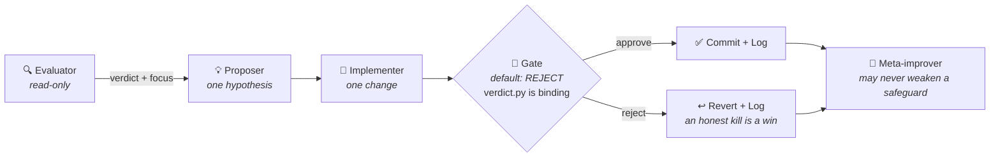

<div align="center">

```
███████╗ ███████╗ ██╗      ███████╗ ███████╗ ███╗   ███╗ ██╗ ████████╗ ██╗  ██╗
██╔════╝ ██╔════╝ ██║      ██╔════╝ ██╔════╝ ████╗ ████║ ██║ ╚══██╔══╝ ██║  ██║
███████╗ █████╗   ██║      █████╗   ███████╗ ██╔████╔██║ ██║    ██║    ███████║
╚════██║ ██╔══╝   ██║      ██╔══╝   ╚════██║ ██║╚██╔╝██║ ██║    ██║    ██╔══██║
███████║ ███████╗ ███████╗ ██║      ███████║ ██║ ╚═╝ ██║ ██║    ██║    ██║  ██║
╚══════╝ ╚══════╝ ╚══════╝ ╚═╝      ╚══════╝ ╚═╝     ╚═╝ ╚═╝    ╚═╝    ╚═╝  ╚═╝

                    ⚒  forge → test → gate → repeat  ⚒
```

**A self-improving loop that forges itself, one tested change at a time.**


[](LICENSE)

</div>

**Selfsmith is a copy-and-fill template for building disciplined, unattended, self-improving [Claude Code](https://claude.com/claude-code) loops** — extracted from a production harness and hardened so the loop can't fool itself and can't wreck your machine.

You point it at something measurable (an eval score, a latency number, a pass rate). Every iteration, it evaluates the current state, makes **one** reversible change, tries to **kill** that change with an adversarial gate backed by real statistics, and logs the honest outcome — win or kill. Then it does it again.

```bash
git clone https://github.com/mboss37/selfsmith && cd selfsmith/examples/latency-tuner
pip install -r requirements.txt && python -m pytest sim/ -q   # watch the whole harness prove itself
claude                                                        # then type: /iterate
```

No API key needed for the examples — they run offline and deterministic.

---

## Table of contents

- [What is this?](#what-is-this)
- [Why not just prompt "improve yourself in a loop"?](#why-not-just-prompt-improve-yourself-in-a-loop)
- [The examples](#the-examples)
- [Build your own loop](#build-your-own-loop)
- [How an iteration works](#how-an-iteration-works)
- [Ways to run it](#ways-to-run-it)
- [The safety model — read before running unattended](#the-safety-model--read-before-running-unattended)
- [The 10 principles](#the-10-principles)
- [Repo layout](#repo-layout)
- [FAQ](#faq)
- [Contributing](#contributing)

---

## What is this?

Anthropic's **evaluator–optimizer pattern**, disciplined enough for unattended operation. One role evaluates and diagnoses. Another proposes and implements. A third tries to kill the change. The machine can only improve by running this cycle — it can never promote itself past the gate.



Two properties make it safe to leave running:

1. **A mechanical floor the loop can't lift.** A shell hook — not an instruction — gates Bash *and* the file-edit tools, so the loop can't rewrite its own guardrail, settings, or a protected path (holdout data, traffic traces) by any route. It fails closed on unparseable input. For unattended runs, an OS-level jail ships in [`template/sandbox/`](template/sandbox/).
2. **Gates default to REJECT, and their arithmetic is code.** The statistical certification lives in [`tools/verdict.py`](template/tools/verdict.py) — a plausible-but-wrong gain can charm an LLM reviewer, but it can't charm an exact sign test that refuses to run without a declared search budget.

It comes in **two flavors**, both expressed by the same engine and both shipped as complete worked examples:

| Flavor | Shape of the problem | Worked example |
|---|---|---|
| **Optimize a running system** | Tune something live: parameters, thresholds, configs. Holdout = out-of-time data. | [`examples/latency-tuner/`](examples/latency-tuner/) |
| **Discover and validate** | Search a candidate space for what genuinely generalizes. Holdout = sacred held-out split. | [`examples/prompt-technique-tournament/`](examples/prompt-technique-tournament/) |

---

## Why not just prompt "improve yourself in a loop"?

Because an unguarded loop fails in predictable ways — and each failure mode here ships with a structural countermeasure, not a polite instruction:

| Failure mode | What ships against it |
|---|---|
| The loop **games its own metric** (reward-hacking) | Holdout discipline; hard floors checked with `verdict.py floor`; metrics designed so the hack shows up as a regression (see the latency-tuner's +10s error penalty) |
| A **plausible-but-wrong gain** talks its way past review | `tools/verdict.py` — sign test / paired bootstrap, **Bonferroni-deflated by a candidate budget declared up front**; it fails closed if the budget is undeclared, and its REJECT is binding on the gate agent |
| The loop **edits its own guardrails** | PreToolUse hook gates Bash + Edit/Write/MultiEdit/NotebookEdit against protected paths, fails closed; sandbox configs keep the floor files read-only at the OS level |
| The metric itself is **broken or noisy**, so every verdict is a coin flip | `tools/metric-contract.sh` — Step 0 of instantiation: the metric must be numeric, deterministic, and score a planted-bad control worse than a known-good, or the loop doesn't start |
| **Activity theatre** — busywork when nothing real is left | Honest-negative logging ("tested, killed, why" is a win); stall detection in the driver; "no change, insufficient data" is a valid iteration |
| A wedged or over-eager iteration **burns the machine or the budget** | Single-flight lock, wall-clock time-box (`ITER_TIMEOUT`), per-iteration turn budget (`ITER_MAX_TURNS`), resource ceilings in the sandbox configs |
| The gate itself **rots** | `verdict.py self-test` — an automated known-nothing control, run at the start of every gate review and in CI |

Every one of these is exercised by tests (219 across the two examples), and CI diffs the instantiated copies against the template so nothing drifts silently.

---

## The examples

Both examples are **offline, deterministic, and fully instantiated from the template** — and each ships a **planted trap**: a candidate that looks like the best thing on the in-sample data and fails out-of-sample. "The gate bites" is a tested property here, not a claim.

### 🏆 `prompt-technique-tournament/` — discover and validate

The loop runs a tournament over prompting techniques (few-shot, chain-of-thought, decomposition, …) for a support-message triage task, hunting for the technique that generalizes to **unseen cases** — not the one that merely tops the dev leaderboard.

```bash
cd examples/prompt-technique-tournament
python eval/run_eval.py --technique few_shot --split dev --model mock   # score any technique
python -m pytest eval/ -q                                               # 129 tests, all green
claude   # then: /iterate
```

- **The trap:** `keyword_rules` — a surface-token heuristic that wins +2 cases on dev and +0 on holdout. `verdict.py reproduce` rejects it mechanically.
- **The converged champion:** `few_shot+chain_of_thought+decomposition` (35% → 90%), whose final claim survives an exact sign test deflated by the full 24-candidate budget (11W/0L on holdout, p ≈ 0.001).
- **Good to know:** three-way split discipline (train = build, dev = iterate, holdout = adjudicate once), and a production seam (`--model claude`) if you want to run it against a real model. Details in [its README](examples/prompt-technique-tournament/README.md).

### ⚡ `latency-tuner/` — optimize a running system

The loop tunes a service's retry policy (`timeout_ms`, `retries`, `backoff_ms`) against deterministically replayed traffic. The seed config is breaching its SLO (7.3% errors against a 2% budget); the loop must fix the floor, then cut latency — and every promotion must survive an **out-of-time** holdout window where the upstream has degraded.

```bash
cd examples/latency-tuner
python sim/run_eval.py --config config.json --window train              # score the champion
python -m pytest sim/ -q                                                # 90 tests, all green
claude   # then: /iterate
```

- **The trap:** `timeout_ms=260, retries=3` **tops the train leaderboard** — and runs **8.8% errors** (4× the budget) on the holdout window, where congestion persists across retries. `verdict.py floor` kills it.
- **The lesson encoded in the metric:** success-only latency *improves* when you fail fast — the classic ops reward-hack. So the headline stat costs every error at +10s, and the error floor is checked separately. Both mechanically.
- **Good to know:** time-based holdout (days 6–7 vs 1–5), continuous-metric certification via seeded paired bootstrap, trace checksums pinned in tests so nobody can move the ruler. Details in [its README](examples/latency-tuner/README.md).

**Which one should I read first?** If your problem is "tune the thing that's already running", read the latency-tuner. If it's "find the best candidate out of many", read the tournament. If you're just evaluating Selfsmith, read either README top to bottom — they're short.

---

## Build your own loop

### 1. Copy the template

```bash
cp -r template/ my-loop/ && cd my-loop
```

### 2. Prove your metric first (Step 0 — don't skip this one)

The loop is only as good as the metric it optimizes. Before filling any other blank, open `metric-contract.env` and give it two commands: one that prints the metric for a **known-good** variant, one for a **planted-bad** control. Then:

```bash
bash tools/metric-contract.sh   # must print PASS: numeric, deterministic, separating
```

If you can't name a planted-bad control your metric scores worse — you don't have a metric yet, you have an opinion, and no downstream gate can save a loop that optimizes an opinion.

### 3. Fill the blanks

Follow [`INSTANTIATE.md`](template/INSTANTIATE.md) — an ordered checklist (GOAL → PERSONA → METHODOLOGY → guardrail → agents → iterate command → run mechanism) with a glossary of every `{{TOKEN}}`. The big ones:

| Token | What it is |
|---|---|
| `{{PROVE_COMMAND}}` | The command that produces your metric — the loop's whole reason to exist |
| `{{VERIFY_COMMAND}}` | Your test/lint gate — must exit 0 before any change is kept |
| `{{DOMAIN_SAFETY_FLOOR}}` | The constraint no agent may ever trade against the metric |
| `{{DOMAIN_FORBIDDEN_PATTERN}}` / `{{PROTECTED_PATHS}}` | What the guardrail hook hard-blocks (commands / files) |

While you're in `GOAL.md`, **declare your candidate budget** (how many configs/candidates this campaign may try) — `verdict.py` refuses to certify significance without it, by design.

### 4. Prove the guardrail fires

`bash -n .claude/hooks/guardrail.sh` only proves it parses. Both examples ship a `test_guardrail.py` corpus that feeds the hook real tool-call JSON and asserts the floors return exit 2 on forbidden calls and 0 on benign ones — copy that pattern and point it at your Floor-1 rules.

### 5. Run it

See [Ways to run it](#ways-to-run-it) below. Start manual (`/iterate`), graduate to scheduled once you trust the log.

### What a finished loop looks like

| Part | Role |
|---|---|
| `.claude/commands/iterate.md` | **Orchestrator** — thin router; runs ONE disciplined iteration |
| `.claude/agents/*.md` | **Worker roles** — evaluator, proposer, implementer, gate, meta-improver |
| `.claude/hooks/guardrail.sh` + `settings.json` | **The floor** — a mechanical guardrail the loop can't lift itself |
| `GOAL.md` | Mission, priority order, acceptance test, **candidate budget**, definition of done |
| `PERSONA.md` | Decision philosophy — a named expert archetype and operating principles |
| `METHODOLOGY.md` | "How we don't fool ourselves" — rulebook and go/no-go gate |
| `LOG.md` | **Memory** — append-only honest diary, one entry per iteration |
| `tools/verdict.py` + `tools/metric-contract.sh` | **The arithmetic** — mechanical certification + the prove-your-metric contract |
| `sandbox/` | **The jail** — container / systemd / Seatbelt configs for unattended runs |
| `run-iteration.sh` + `drive-to-goal.sh` | **The drivers** — fresh-session, single-flight, time-boxed, budget-capped ticks |

### The worker archetypes

Five roles cover every safe self-improvement loop (simple loops can drop the proposer):

| Archetype | Tools | Job |
|---|---|---|
| **Evaluator** | read-only | Judge current state vs GOAL; verdict + diagnosis + recommended focus |
| **Proposer** | read-only | ONE mechanism-backed change with a falsifiable expected effect |
| **Implementer** | write | Make the ONE change, test-first, measure, prove it |
| **Gate** | read-only, **VETO** | Adversarially try to kill the change; default-REJECT; `verdict.py` outcomes are binding |
| **Meta-improver** | write | Improve the loop itself; **may never weaken a safeguard** |

The gate is the most important archetype. It runs independently, cannot be overridden by the implementer, and must reach a verdict before any change is accepted.

---

## How an iteration works

One `/iterate` = one pass through this, in order. Every step that can be a command instead of an opinion, is one.

1. **Evaluate** — metrics, data health, verdict. A suspected measurement bug outranks every other finding; the metric contract re-runs at triage when in doubt.
2. **Decide ONE change** — from the evaluator's focus and GOAL's priority order. No bundling.
3. **Propose + implement** — hypothesis with a stated mechanism, then the minimal change, measured.
4. **Gate** — `verdict.py self-test`, then the certification mode that matches the claim (`screen` / `reproduce` / `confirm` / `compare` / `floor`), then the judgment axes (safety, regression, redundancy). REJECT → revert, log, done.
5. **Verify** — the test suite must be green.
6. **Prove** — the metric must actually move as predicted.
7. **Commit** — only after gate + verify + prove.
8. **Log** — one honest entry, including kills and no-ops.
9. **Meta-check** — route loop weaknesses to the meta-improver (which may strengthen, but never weaken, a safeguard).
10. **Notify** — signal a human, never wait for one.

---

## Ways to run it

| Mode | Command | When to use it |
|---|---|---|
| **Manual** | `claude` → `/iterate` | First runs; building trust in the log |
| **Session loop** | `/loop 1h /iterate` | Supervised continuous runs (any interval; omit it and the model self-paces) |
| **Timer** (cron / launchd / systemd) | `0 * * * * cd /path/to/my-loop && ./run-iteration.sh` | **Ongoing** work — tuning a live system where you *want* spacing so new data accumulates |
| **Run until done** | `./drive-to-goal.sh` | **Bounded** work — a finish line to converge on, then stop (DONE marker, stall detection, `MAX_ITERS` cap) |
| **Sandboxed** | `./sandbox/run-sandboxed.sh` | Any unattended run — same tick, inside the container jail |

For anything scheduled, always go through **`run-iteration.sh`** — never raw `claude`:

- **Fresh session per tick** (`claude -p`, never `--continue`). The loop's memory is on disk — `LOG.md`, champion state, git — so every run re-grounds from truth instead of drifting on stale context.
- **Single-flight lock** — overlapping ticks skip cleanly (with stale-lock reclaim).
- **Time-box** — `ITER_TIMEOUT` (default `50m`) kills a wedged iteration. Needs GNU `timeout`/`gtimeout`; stock macOS has neither until `brew install coreutils`, and the wrapper warns on stderr when running without a ceiling.
- **Spend ceiling** — `ITER_MAX_TURNS` (default `50` agent turns via `--max-turns`). An unattended loop needs a budget floor it cannot argue past, exactly like the safety floor. Raise it deliberately; don't remove it.

---

## The safety model — read before running unattended

Two layers. Know which one you're relying on:

**Layer 1 — the tripwire (ships in `.claude/hooks/`).** A PreToolUse hook gates Bash *and* the write tools against protected paths and forbidden commands, mirrors redirects/`cp`/`tee`/`sed -i` against the write-tool rules, and fails closed on unparseable input. It catches honest mistakes cold. But a string-matching deny-list is **not a security boundary** — shell quoting and obfuscation can evade any regex.

**Layer 2 — the jail (ships in [`template/sandbox/`](template/sandbox/)).** OS-level enforcement where destructive syscalls are impossible regardless of what the loop tries:

| Option | Strength | Files |
|---|---|---|
| Container (any OS) | Strongest, portable | `Dockerfile`, `run-sandboxed.sh` — read-only rootfs, dropped capabilities, pid/memory ceilings, floor files mounted read-only *inside* the writable area |
| systemd hardened unit (Linux) | Strong, no container runtime | `selfsmith-loop.service` + `.timer` — `ProtectSystem=strict`, `ReadOnlyPaths` on the floor, syscall filter |
| Seatbelt profile (macOS) | Good, built-in | `claude-loop.sb` — deny-all-writes except the working set, floor re-denied inside it |

Also distinguish the **mechanical floor** (hook + sandbox — hard blocks) from the **disciplinary controls** (gate veto, meta-improver restraint — LLM judgment). Judgment layers make the loop *productive*; only the mechanical layers make it *safe*. And verify the jail once before trusting it: from inside, `touch .claude/hooks/x` and `touch /etc/x` must both fail with permission errors. A jail you haven't seen refuse a write is a hypothesis.

---

## The 10 principles

These are the IP — carry them verbatim when instantiating.

1. Doing and checking are **never the same role** — independent adversarial review with veto.
2. **One change per iteration** — reversible, logged, attributable.
3. The loop **can't lift its own floor** — hook (mechanical, gates Bash + write tools, fails closed) + gate (judgment) + meta-improver barred from loosening safeguards. The deny-list is a tripwire; the real boundary for unattended runs is an OS sandbox.
4. Orchestrator is a **thin router** — triage → route → decide, never implements.
5. Gates **default to REJECT** — killing a good idea is cheaper than shipping a bad one.
6. **Honest negatives count** — "tested, killed, why" is a win; no activity theatre.
7. **Never block on a human, always able to reach one** (notify escape hatch).
8. **Priority order puts correctness/safety above the headline metric** — never optimize on a broken measurement.
9. **Meta-improvement is first-class but separate** — the loop gets better at getting better.
10. **Reward-hacking is an explicit threat** — guardrails against the loop gaming its own metrics.

---

## Repo layout

```
selfsmith/
├── template/                          ← copy this to start your own loop
│   ├── INSTANTIATE.md                 ← the ordered fill-in checklist (start here)
│   ├── metric-contract.env            ← Step 0: prove your metric first
│   ├── GOAL.md · PERSONA.md · METHODOLOGY.md · LOG.md
│   ├── .claude/
│   │   ├── commands/iterate.md        ← the orchestrator slash command
│   │   ├── agents/                    ← the five worker archetypes
│   │   ├── hooks/guardrail.sh         ← the mechanical floor (fails closed)
│   │   └── settings.json              ← wires the hook to Bash + write tools
│   ├── tools/
│   │   ├── verdict.py                 ← mechanical gate certification (stdlib only)
│   │   └── metric-contract.sh         ← the prove-your-metric contract
│   ├── sandbox/                       ← the jail: Docker, systemd, Seatbelt + README
│   ├── run-iteration.sh               ← fresh-session, locked, time-boxed, budget-capped tick
│   └── drive-to-goal.sh               ← run ticks back-to-back until convergence
└── examples/
    ├── prompt-technique-tournament/   ← discover-and-validate flavor, fully instantiated
    └── latency-tuner/                 ← optimize-a-running-system flavor, fully instantiated
```

CI runs both example suites and enforces **parity**: the runners, `verdict.py`, `metric-contract.sh`, and the guardrail's machine-safety floor are byte-diffed between the template and every example — instantiated copies cannot silently drift.

---

## FAQ

**Do I need an API key?**
Not for the examples — they're offline and deterministic (the tournament has an optional `--model claude` seam for real calls). Your own loop runs inside your normal Claude Code session/subscription; scheduled headless runs (`claude -p`) authenticate however your CLI already does.

**What does an iteration cost?**
One `/iterate` is a handful of subagent calls (the gate defaults to a stronger model — see the `model:` frontmatter in `agents/*.md`, and change it if you want cheaper runs). Unattended ticks are capped by `ITER_MAX_TURNS` (default 50 turns) and `ITER_TIMEOUT` (default 50m), so a runaway iteration is cut off mechanically.

**My metric isn't a test score. Can I still use this?**
If a shell command can print it as a number, yes — that's the whole interface (`{{PROVE_COMMAND}}`, plus the Step 0 contract). If no command can print it, build that first; the loop cannot optimize what it cannot measure.

**What if my domain has no natural holdout?**
Use time: tune on last week, adjudicate on this week (the latency-tuner shows exactly this). The only rule is that the adjudication data must never be iterated against.

**Why does `verdict.py` refuse to run without `--search-size`?**
Because "we tried N things and this one won" needs deflating by N — including the candidates you tried and quietly dropped. Undeclared search is the main way loops fool their authors, so the tool fails closed rather than defaulting to 1. Declare your budget in `GOAL.md` up front.

**Can the loop edit its own prompts?**
Yes — that's the meta-improver, and it's first-class. What it can never do is weaken a safeguard: those changes must go to the gate and page a human, and the guardrail files themselves are hook-protected and (in the sandbox) OS-read-only.

**How do I trust it enough to leave it running?**
Read `LOG.md` after a few supervised iterations. A trustworthy loop's diary contains kills, no-ops, and reverts — not just wins. Then run it in the sandbox anyway.

---

## Contributing

Contributions are very welcome — this template exists to be useful to the community, and the best way to improve it is more real-world instantiations.

Especially valuable:

- **New worked examples** — a third domain (code performance, RAG retrieval quality, CI flakiness, agent prompt tuning, …) instantiated from the template. Follow the two existing examples' shape: offline/deterministic if possible, a planted trap the gate must catch, a full test corpus, and the shared files (`run-iteration.sh`, `drive-to-goal.sh`, `tools/`) byte-identical to the template — CI enforces this.
- **Guardrail bypass reports** — found a Bash construction that slips Floor 2, or a payload the parser mishandles? Open an issue or PR with the case added to a `test_guardrail.py` corpus, pinned closed.
- **Sandbox configs** — hardened profiles for platforms not covered yet (Windows, BSD, other container runtimes).
- **Methodology scar tissue** — a failure mode you hit running a loop of your own, written up as a `METHODOLOGY.md` pitfall with the countermeasure that fixed it.

Ground rules (they're the same rules the loop itself lives by): keep template/example parity green, never weaken a shipped safeguard or the fail-closed behavior, and every claimed protection needs a test that proves it fires — a positive control the check must catch, plus a clean negative.

```bash
# the full local check before you open a PR
(cd examples/prompt-technique-tournament && python -m pytest eval/ -q)
(cd examples/latency-tuner && python -m pytest sim/ -q)
python3 template/tools/verdict.py self-test
```

## License

[MIT](LICENSE) — take it, fork it, ship loops.
